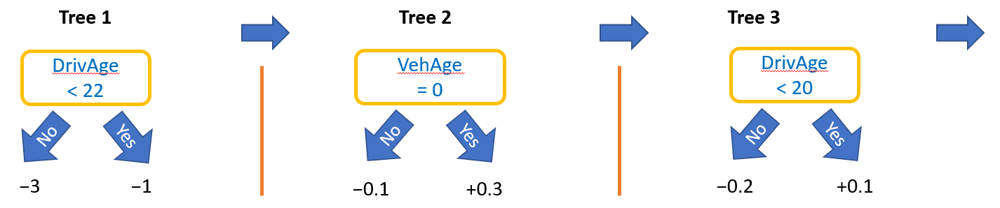
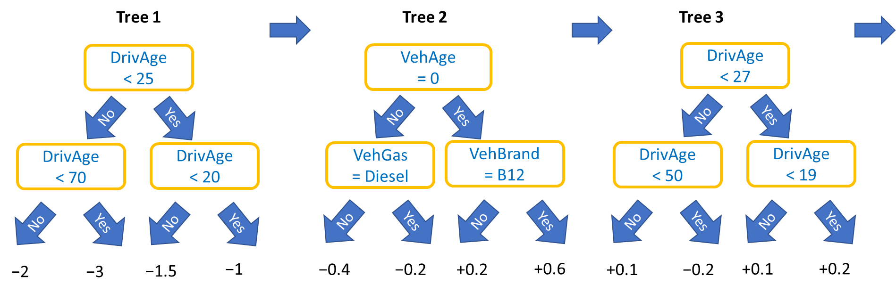
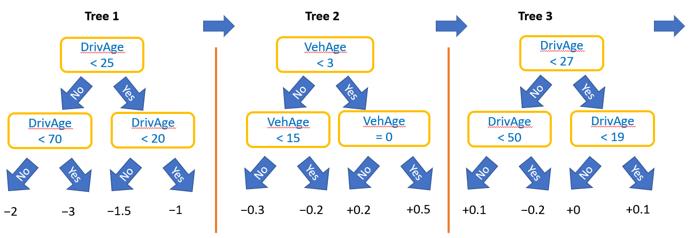
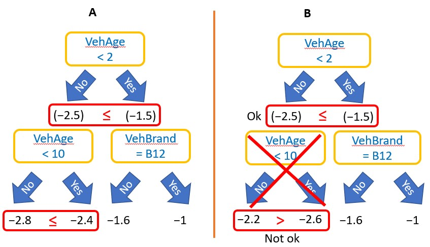
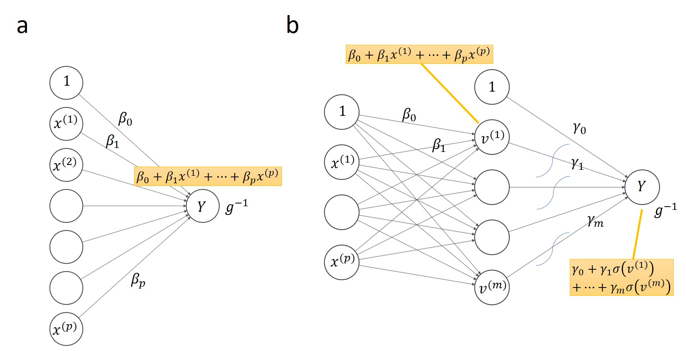

```{r setup, include=FALSE}
knitr::opts_chunk$set(
  echo = TRUE, 
  warning = FALSE, 
  message = FALSE,
  eval = TRUE
)
```

# Introduction

> "The best explanation of a simple model is the model itself"

[@lundberg2017]

Welcome to the last chapter of the XAI part of the lecture "Responsible Machine Learning with Insurance Applications". It is dedicated to improving the intrinsic explainability of ML models.

Regarding intrinsic explainability, there is the following basic hierarchy:

1. Linear additive models (like GLMs): Their model structure is so simple that the effects can be read off directly from the numerical model output.
2. Additive models (like GAMs): It is still possible to give a complete description of the effects, but they must be visualized for interpretation. 
3. Black box models (like boosted trees or neural nets): These models contain many complex interactions, so that the effects can only be described approximately. Without interaction effects, such models would be additive and as transparent as a GAM.

The boundaries are blurred: GLMs can also include nonlinear effects and interaction terms. If one adds many interaction terms to a GLM or a GAM, it becomes almost as complex as a neural network. On the other hand, the complexity of boosted trees models and neural networks can be reduced by enforcing additivity for all or some features.

In the next two sections, we will learn how to create such additive and partly additive boosted trees and neural nets. By *partly additive*, we mean models that are additive in some features but have interactions between other variables. It is just another term for "additive with (possibly complex) interactions". Examples of such partly additive models in actuarial science are as follows:

- Keep the "time" effect additive while letting the other covariates interact freely. In this way, the ML model can be manually calibrated to obtain unbiased predictions out-of-time.
- Use an additive gender effect while allowing other features to interact. This allows to retrospectively remove a potentially discriminatory gender effect from the ML model. (Why not simply dropping gender from the model?)
- The location can be represented by a complex interaction effect between latitude and longitude, leaving all other features additive for interpretability.
- Same as the last example, but representing location by a large set of (often highly-correlated) features like "distance to next bus stop" or "distance to next restaurant", see @mayer2022 for two case studies with real-estate data. (How can such models be used for supervised dimension reduction?)
- In a car insurance pricing model, one could use additive features for the driver's  attributes, while allowing the vehicle characteristics (engine size, power, speed, ...) to interact freely.

Furthermore, we will see how monotonic constraints can additionally improve intrinsic interpretability of boosted trees.

Remarks:

- Single decision trees do not fit into above hierarchy. They are neither linear nor additive, but still intrinsically interpretable.
- For models with link functions, additivity is meant at the link scale, since the back transformation to the response scale introduces interaction effects. In most cases, we interpret such a model on the link scale.

```{r}
library(tidyverse)
library(splitTools)
library(withr)
library(mgcv)
library(lightgbm)
library(MetricsWeighted)
library(flashlight)
library(shapviz)
library(grid)
library(gridExtra)
library(keras)
# install_keras() # if no Python with TensorFlow is installed yet
# devtools::install_github("andrie/deepviz")
library(deepviz)

# Reload data and model-related objects
main <- "french_motor"
# main <- file.path("r", "french_motor")
refit <- TRUE # Set to FALSE after frist run

load(file.path(main, "intro.RData"))
fit_lgb <- lgb.load(file.path(main, "fit_lgb.txt"))

# Shuffle training data to be sure that batch creation of neural nets is random
with_seed(938, 
  train <- train[sample(1:nrow(train)), ]
)

# Function that calculates performance and plots some c-ICE plots
summary_model <- function(model, pred_fun = predict, 
                          v = c("DrivAge", "logDensity", "VehAge", "VehBrand")) {
  fl <- flashlight(
    model = model, 
    label = "any_model", 
    data = test, 
    y = y, 
    w = w, 
    metrics = list(`Relative deviance reduction` = r_squared_poisson),
    predict_function = pred_fun, 
    linkinv = log
  )
  
  the_plot <- function(z) {
    light_ice(
      fl, 
      z, 
      center = "middle", 
      n_max = 200, 
      seed = 482, 
      evaluate_at = unique(fl$data[[z]])
    ) %>% 
      plot(color = fillc, alpha = 0.1) + 
      labs(title = sprintf("c-ICE plot of '%s'", z), y = "Centered log frequency") +
      theme(plot.title = element_text(size = 11))
  }
      
  the_title <- sprintf(
    "%s (deviance gain %s)", 
    deparse1(substitute(model)),
    scales::percent(light_performance(fl)$data$value, accuracy = 0.01)
  )
  
  p <- lapply(v, the_plot)
  grid.arrange(
    grobs = p, 
    top = textGrob(the_title, gp = gpar(fontsize = 13, fontface = "bold"))
  )
}

# Function that plots a couple of SHAP plots
shap_analysis <- function(model, X, 
                          v = c("DrivAge", "logDensity", "VehAge", "VehBrand")) {
  shp <- shapviz(model, X_pred = data.matrix(X), X = X)

#   (sv_importance(shp) +
#     ggtitle("SHAP importance plot")) %>% 
#     print()

  the_plot <- function(z) {
    sv_dependence(shp, z, "auto", alpha = 0.5) + 
      labs(title = z, y = "SHAP value") +
      theme(plot.title = element_text(size = 11))
  }
  
  grid.arrange(
    grobs = lapply(v, the_plot), 
    top = textGrob("SHAP dependence plots", gp = gpar(fontsize = 13, fontface = "bold"))
  )
}

# Some prediction function
pred_lgb <- function(fit, X) predict(fit, data.matrix(X[x]))
pred_exp <- function(m, X) predict(m, X, type = "response")
```

# Structuring Boosted Trees

While the prediction function of a single decision tree is simple to interpret, the same is not true for boosted trees models. Its prediction function
$$
  m(\boldsymbol x) = m_1(\boldsymbol x) + \dots + m_K(\boldsymbol x),
$$
equals the sum of $K \ge 1$ decision trees $m_k$, and one has to rely on post-hoc explainability methods from Chapter 2 to approximately understand $m$. Here, we will learn two ways how to simplify the internal structure of a boosted trees model to improve its (intrinsic) interpretability.
The first approach produces additive models. The second approach is more general and can be also used to fit partly additive models.

## Additive boosted trees

A *tree stump* is a decision tree with a single split. Its prediction function has the form $v_1 + (v_2 - v_1)\mathbb I(x^{(j)} \le s)$, where $\mathbb I$ is the indicator function, $s$ the split value of the selected variable $x^{(j)}$, and $v_1, v_2$ are the values of the left and right leaf. A boosted trees model with tree stumps as base learners (boosted tree stumps) is thus an additive model
$$
  m(\boldsymbol x) = \beta_o + f_1(x^{(1)}) + \dots + f_p(x^{(p)}),
$$
with piecewise constant functions $f_j$, $1 \le j \le p$. A schematic view of such a model for our French MTPL dataset could look as follows:



Unlike the classic GAM [@hastie1986; @hastie1990; @wood2017], the functions $f_j$ are not smooth, which is a disadvantage in some applications. An advantage of using boosted tree stumps to fit GAMs is that modern boosting implementations can handle large datasets consisting of millions of rows and many covariates, where classic approaches would be too slow. 
The resulting model is as easy to interpret as a classic GAM, i.e., each component $f_j$ can be visualized, for instance, by an ICE or PDP plot that provides a complete description of the effect of that feature. 

Remark: The SHAP dependence plot of an additive feature in a boosted trees model is equivalent to the PDP/ICE plot up to a vertical shift. Thus, like the PDP, it can be interpreted Ceteris Paribus [@mayer2022b].

Additive boosted trees models are discussed in the literature, e.g., in @lou2012 and @nori2019.

### Example

First, we fit an additive Poisson boosted trees model with log-link to the French MTPL data. To force LightGBM to use tree stumps as base learners, we can set either `num_leaves = 2` or `max_depth = 1`. The other parameters have been found by random parameter search using (grouped) five-fold cross-validation. How does the model compare with the classic GAM? 

Besides showing relative deviance gains on the test dataset, throughout this section, we will report c-ICE plots of selected variables. For boosted trees models, we will additionally show corresponding SHAP dependence plots. c-ICE plots are evaluated at all unique feature values.

First, we analyze the classic GAM, then the additive LightGBM model.

```{r}
dtrain <- lgb.Dataset(
  data.matrix(train[x]), 
  label = train[[y]], 
  weight = train[[w]],
  params = list(feature_pre_filter = FALSE)

)

if (refit) {
  # Found by cross-validation (-> french_motor/tune_additive_lgb.R)
  # Of key importance: "num_leaves = 2" or "max_depth = 1"
  params <- list(
    learning_rate = 0.5, 
    objective = "poisson", 
    num_leaves = 2, 
    colsample_bynode = 1, 
    bagging_fraction = 1, 
    lambda_l1 = 0, 
    lambda_l2 = 2.5, 
    num_threads = 7  # system dependent
  )

  with_seed(4438,
    fit_lgb_add <- lgb.train(params = params, data = dtrain, nrounds = 514)
  )
  lgb.save(fit_lgb_add, file.path(main, "fit_lgb_add.txt"))
} else {
  fit_lgb_add <- lgb.load(file.path(main, "fit_lgb_add.txt"))
}

# Inspect
summary_model(fit_gam, pred_fun = pred_exp)     # 2.2%
summary_model(fit_lgb_add, pred_fun = pred_lgb) # 2.89%

with_seed(536, 
  X_small <- sample_n(train[x], 2000)
)
shap_analysis(fit_lgb_add, X_small)
```

**Comments:**

- c-ICE curves indicate parallel ICE curves, confirming additivity for each covariate and model on the log-scale. 
- The additive LightGBM model performs better than the (classic) GAM model, probably a result of its non-smooth effects.
- Thanks to additivity, the SHAP dependence plots of the LightGBM model indeed provide the same effects as the c-ICE curves.
- Fitting the LightGBM is much faster than the GAM.

## Partly additive boosted trees

In many situations, assuming additivity for all features leads to an unrealistically simple model. One way to relax the assumption for boosted trees is to grow trees of depth $m > 1$ (not counting the root node). For instance, if $m = 2$, the model can learn all pairwise interactions (why?). Similarly, larger tree depths allow higher order interactions to be represented. 

What if we want to model some features additively while using interactions for other features? Such partly additive models can be created by specifying *interaction constraints*
$$
  IC = \{F_1, \dots, F_M\},
$$
where each $F_m \subseteq \mathcal M$ defines a feature subset allowed to interact with each other [@lee2015].

How do interaction constraints work technically? During tree growth, a split considers features only from those $F_m$ that contain all previous split variables of the branch. Consequently, each branch in each tree will only use features from one $F_m \in IC$. This implies the desired structure for the tree and also for a tree ensemble.

Interaction constraints can be used to create partly additive boosted trees models. For instance, to have a model additive in $x^{(j)}$, we need to set $F_m = \{x^{(j)}\}$, and make sure that $x^{(j)} \notin F_k, \ k \ne m$.

The following scheme shows a partly additive model with interaction constraints
$$
  IC = \{\{\text{DrivAge}\}, \{\text{logDensity}\}, \{\text{PolicyRegion}\}, \{\text{VehAge}, \text{VehBrand}, \text{VehGas}, \text{VehPower}\}\}.
$$
The resulting model will be additive in driver-related features while allowing vehicle features to interact.



Remarks: 

- If all elements in $IC$ are disjoint, each tree uses features from only one $F_m$. (The first split variable determines which of the $F_m$.)
- As an alternative to boosted tree stumps, we can specify $IC = \{\{x^{(1)}\}, \dots, \{x^{(p)}\}\}$ to create an additive boosted trees model, see the figure below.



### Example

Let us now create a model with above structure. We will compare it with the unconstrained LightGBM model.

```{r}
# Build interaction constraint vector
x_veh <- x[startsWith(x, "Veh")]
(ic <- c(list(x_veh), as.list(setdiff(x, x_veh))))

if (refit) {
  # Found by cross-validation (-> french_motor/tune_partly_additive_lgb.R)
  # Of key importance: "interaction_constraints"
  params <- list(
    learning_rate = 0.05, 
    objective = "poisson", 
    num_leaves = 63, 
    min_data_in_leaf = 20, 
    min_sum_hessian_in_leaf = 0.1, 
    colsample_bynode = 1, 
    bagging_fraction = 1, 
    lambda_l1 = 0, 
    lambda_l2 = 0,
    num_threads = 7, 
    interaction_constraints = ic
  )
  
  with_seed(4458,
    fit_lgb_part_add <- lgb.train(
      params = params, 
      data = dtrain, 
      nrounds = 554, 
      verbose = -1
    )
  )  
  lgb.save(fit_lgb_part_add, file.path(main, "fit_lgb_part_add.txt"))
} else {
  fit_lgb_part_add <- lgb.load(file.path(main, "fit_lgb_part_add.txt"))
}

# Inspect
summary_model(fit_lgb, pred_fun = pred_lgb)          # 5.04%
summary_model(fit_lgb_part_add, pred_fun = pred_lgb) # 4.82%
shap_analysis(fit_lgb_part_add, X_small)
```

**Comments:**

- The c-ICE curves of the partly additive model indeed show additive effects for driver-related features and interaction effects for vehicle characteristics. The SHAP analysis confirms this. The original model shows interaction effects for all features.
- The performance of the partly additive model is not much lower than that of the original, fully flexible LightGBM model. This means that any suppressed interaction effects cannot be too strong.
- The additive effect of "logDensity" is extremely shaky, which is unsatisfactory. Interestingly, the fully additive model was more stable in this respect. It is possible that the model tries to compensate for an omitted interaction. In the next subsection we will see how this problem can be at least partially solved.

## Monotonic constraints

So far, we have improved the intrinsic interpretability of a black box by removing interactions. For tree-based models, another aspect can be exploited: Monotonicity. 
By monotonicity in a feature, we mean that $m$ is a monotonically increasing or decreasing function in that feature, everything else being fixed.

In practice, the usefulness and trustworthiness of a model can drop dramatically if it fails to satisfy certain monotonic constraints. Here two examples:

- A claims severity model for car collisions is expected to be monotonically increasing in the car value, everything else being fixed.
- A claims frequency model for car collisions is expected to be monotonically decreasing in the deductible, Ceteris Paribus.

How do monotonic constraints work? To enforce monotonicity for the $j$th feature in a decision tree, the rule is essentially as follows: A candidate split that violates the condition on its child nodes receives an infinite penalty and is therefore discarded. 

In the following scheme, Tree A represents a prediction function (on log claims frequency scale) that is monotonically decreasing in the vehicle age. The split on the lower left of Tree B violates this constraint and is discarded (and replaced by some other split).



Remarks: 

- Monotonicity also translates to tree ensembles such as boosted trees or random forests.
- Use a monotonic constraint only if it makes sense conditional on all possible combinations of the other features. Take a house price model, for example: At first glance, predictions should increase monotonically with the number of rooms. At second glance, this is not necessarily a good idea, because for a fixed living area, more rooms are not necessarily better.
- A monotonicity constraint helps to reduce wiggliness of an effect.
- Furthermore, it works with or without interaction constraints.
- There are also implementations of GAMs and GLMs that allow to take monotonicity into account.
- For flexibly modeled effects, violations of desired monotonicity often happens as a consequence of overfitting on outlying feature values, a problem that can already dealt with during feature preprocessing by truncation.

### Example

In our French MTPL example, there is no feature for which we should really impose monotonicity. Nevertheless, to illustrate the effect, we will force a negative effect for "VehAge" and a positive effect for "logDensity" to reduce its extreme wiggliness. Note that "logDensity" is modeled additively, while "VehAge" can freely interact with other vehicle features. For simplicity, we use the same LightGBM parameters as before.

```{r}
# Build monotonic constraint vector
(mc <- (x == "logDensity") - (x == "VehAge"))

if (refit) {
  # Using params from last example
  params$monotone_constraints <- mc

  with_seed(4358,
    fit_lgb_monotone <- lgb.train(
      params = params, 
      data = dtrain, 
      nrounds = 554, 
      verbose = -1
    )
  )  
  lgb.save(fit_lgb_monotone, file.path(main, "fit_lgb_monotone.txt"))
} else {
  fit_lgb_monotone <- lgb.load(file.path(main, "fit_lgb_monotone.txt"))
}

# Inspect
summary_model(fit_lgb_monotone, pred_fun = pred_lgb) # 4.78%
shap_analysis(fit_lgb_monotone, X_small)
```

**Comments:**

- Indeed: Ceteris Paribus, the effect of "logDensity" is now monotonically increasing while the effect of "VehAge" decreases for each individual ICE curve. 
- Both effects are less wiggly.
- The model performs almost as well as without monotonicity constraints.
- Monotonic constraints combine well with interaction constraints.
- In SHAP dependence plots, monotonicity can only be seen when the feature is modeled additively. Otherwise, the vertical scatter of interaction effects covers it.

# Structuring Neural Nets

In this lecture, we have not yet worked with neural nets. While they are typically not as performant as boosted trees models for tabular data, they are extremely versatile. Here is just a small list of their capabilities: Neural nets can

- mimic models like GLMs or GAMs,
- automatically learn interactions and non-linear effects (like tree-based methods),
- fit data larger than RAM (e.g. images),
- learn "online" (update the model with additional data),
- fit multiple response variables at the same time,
- model input and output of dimension higher than two (images, videos, text, audio),
- model input and output of *different* input dimensions (e.g. text *and* images *and* numbers),
- fit data with sequential structure in both in- and output (e.g., a machine translator),
- fit models with millions of parameters,
- perform non-linear dimension reduction.

We assume that the reader has some background knowledge on neural nets and refer to @james2021 or @chollet2018 otherwise. In the examples, we will work with TensorFlow, using the handy Keras front-end. Since Keras and a part of TensorFlow are written in Python, running the examples in this chapter will require Python in the background, even if our code is written in R.

Within Keras we will work with the *functional API*. It allows to represent very general model structures (also called *architectures* in neural network jargon). Actually, any model that can be characterized as a directed acyclic graph (DAG) could be implemented using this interface. Non-trivial examples include additive and partially additive models. 

## A simple neural net

To familiarize ourselves with Keras and review some neural network terminology, we will first create a very simple neural network - a GLM. It consists of two layers only: The input layer represents the features, and the output layer represents the response variable. The values of the output layer are transformed by the exponential "activation" function, corresponding to the inverse link function of the Poisson GLM. The output layer is *fully connected* or *dense*, which means that the value of its node is a weighted sum of all node values of the previous layer (in this case, of the input layer), see the left hand side of Scheme 4:



The weights are the parameters estimated by *gradient descent*. Normally, the gradient descent update steps are computed by backpropagation, which involves applying the chain rule to find the derivatives of the loss function with respect to all parameters. For a simple model like a GLM, this is straightforward. But imagine a deep learning model with 50 hidden layers and a non-linear transformation after each hidden layer! Computing millions or even billions of derivatives (without seeing the data) is one of the greatest achievements of modern deep learning implementations like TensorFlow and PyTorch.

(Mini-batch) gradient descent with backpropagation works as follows: 

1. Initialization: Parameters are randomly initialized.
2. Forward step: Using the current parameter estimates, the predictions of a *batch* (= a subset) of observations are calculated and their (total) loss is calculated.
3. Backward step: The parameters are modified in the direction of the negative gradient of the loss in order to make the loss on that batch systematically smaller.
4. Steps 2 and 3 are iterated, until each observation in the training data has been used once. This is called an *epoch*.
5. Step 4 is iterated several times, e.g., until the validation loss no longer improves. 

Remarks:

- Step 5 can be specified by an early-stopping *callback*. A callback is an action executed during training. An other callback would be to save the parameters after each epoch.
- To improve convergence, input variables should be on a comparable scale. We will standardize them accordingly by subtracting their (training) mean and then dividing by the (training) standard deviation. Alternatively, we could scale the values of each feature so that they range from 0 to 1 (min-max scaling) or from $-1$ to 1.

### Example: a GLM neural net

Let us now fit a claims frequency GLM with Keras/TensorFlow, i.e., the model in Scheme 4 (a). For simplicity, we encode factor variables like "VehAge" by integers, even if this does not make too much sense (see later examples how to create better models). We use a learning rate of 0.02. This means that each parameter update takes 0.02 steps towards the negative gradient.

```{r}
# bug with case weights: https://github.com/rstudio/keras/issues/1341

# Standardization - required to improve init step
sc1 <- attributes(scale(data.matrix(train[x])))[c("scaled:center", "scaled:scale")]
scaler <- function(X, sc) {
  sc <- lapply(sc, function(z) z[colnames(X)])
  X <- data.matrix(X)
  scale(X, center = sc[["scaled:center"]], scale = sc[["scaled:scale"]])
}

# scaler(head(test[x], 2), sc = sc1)

# Callbacks
cb <- list(
  callback_early_stopping(patience = 20),
  callback_reduce_lr_on_plateau(patience = 5)
)

# Plot performance over epochs after short burn-in phase
plot_history <- function(history, from = 2) {
  history$metrics[c("loss", "val_loss")] %>% 
    data.frame() %>% 
    mutate(epoch = row_number()) %>% 
    filter(epoch >= from) %>% 
    pivot_longer(cols = c("loss", "val_loss")) %>% 
  ggplot(aes(x = epoch, y = value, group = name, color = name)) +
    geom_line(size = 1.4) + 
    ggtitle("Performance by epoch")
}

# Mimics a GLM
make_glm <- function() {
  k_clear_session()
  tensorflow::set_random_seed(469)

  input <- layer_input(7, name = "All_features")
  output <- input %>% 
    layer_dense(units = 1, activation = "exponential", name = "Output")
  
  # Connect inputs and output
  keras_model(inputs = input, outputs = output)
}

# Create, compile and fit model
nn_glm <- make_glm() %>% 
  compile(optimizer = optimizer_adam(0.02), loss = loss_poisson)

# summary(nn_glm) # 8 parameters

nn_glm %>% 
  plot_model()

# Model fitting is slow because of sample_weight bug
if (refit) {
  history <- nn_glm %>% 
    fit(
      x = scaler(train[x], sc = sc1), 
      y = train[[y]],
      sample_weight = train[[w]],
      epochs = 100, 
      batch_size = 1e4,
      validation_split = 0.2,
      callbacks = cb
    )
  plot_history(history)
  save_model_weights_hdf5(nn_glm, file.path(main, "nn_glm.h5"))
} else {
  load_model_weights_hdf5(nn_glm, file.path(main, "nn_glm.h5"))
}

# Inspect
summary_model(fit_glm, pred_fun = pred_exp) # 0.98
summary_model(                              # 0.95
  nn_glm, 
  pred_fun = function(m, X) predict(m, scaler(X[x], sc = sc1), batch_size = 1000)
)
```

**Comments:**

- It worked: The resulting model seems to be indeed a generalized linear model.
- The performance on the test data is slightly lower compared to the original GLM. This may be due to several reasons: First, for simplicity, we represented each feature by a linear function, including some factor variables. Second, the parameters were fitted to only 80% of the training observations. Third, we used gradient descent to fit the parameters, which is a very simple optimization algorithm.

## More complex models

While it is great that a neural network can be used to fit a GLM, its strength lies in its *hidden layers*. The nodes on these hidden layers are latent variables that represent the original input features in a way that optimally predicts the response. The closer a hidden layer is to the output, the more optimal this representation is. This is referred to as *representational learning*: The neural network automatically learns relevant nonlinearities and interaction effects that would have to be added manually in a GLM. For this to work, you need a sufficiently flexible architecture (the layers and their nodes) and enough observations. 

An important component are the *activation functions* placed after each hidden layer. They transform the weighted sum of each hidden node non-linearly, thus introducing interaction effects. Typical activation functions are the rectangular linear unit $ReLU(x) = \text{max}(0, x)$, the inverse logistic function ("sigmoid") and the nearly identical hyperbolic tangent. The activation function applied to the output node has a different purpose: it maps the network output to the scale of the response, just like the inverse link function in a GLM. A neural network without activation functions could only represent a linear function of the inputs, regardless of how many hidden layers the model has (why?).

### Example: A "complex" neural net

We will now modify our GLM neural network by adding three hidden layers to the model, resulting in a model with 561 parameters. Typically, the first hidden layer has more nodes than input features ("feature explosion"), after which the number of nodes shrinks again.

On the one hand, the model needs a large number of parameters to be flexible enough. On the other hand, too many parameters lead to overfitting. For tabular data, a healthy ratio of rows per parameter is somewhere between 50 and 200. When working with unstructured data, different rules apply.

In Scheme 4b, we use only one hidden layer to not overload the image.

```{r}
# Architecture of neural network with hidden layers
make_full_nn <- function() {
  k_clear_session()
  tensorflow::set_random_seed(469)

  input <- layer_input(7, name = "All_features")
  output <- input %>% 
    layer_dense(20, activation = "tanh", name = "Hidden_1") %>%
    layer_dense(15, activation = "tanh", name = "Hidden_2") %>%
    layer_dense(5, activation = "tanh", name = "Hidden_3") %>% 
    layer_dense(1, activation = "exponential", name = "Output")
  
  # Connect inputs and output
  keras_model(inputs = input, outputs = output)
}

# Create, compile and fit model
nn_full <- make_full_nn() %>% 
  compile(optimizer = optimizer_adam(0.02), loss = loss_poisson)

# summary(nn_full) # 561 parameters

nn_full %>% 
  plot_model()

if (refit) {
  history <- nn_full %>% 
    fit(
      x = scaler(train[x], sc = sc1), 
      y = train[[y]],
      sample_weight = train[[w]],
      epochs = 100, 
      batch_size = 1e4, 
      validation_split = 0.2,
      callbacks = cb
    )
  plot_history(history)
  save_model_weights_hdf5(nn_full, file.path(main, "nn_full.h5"))
} else {
  load_model_weights_hdf5(nn_full, file.path(main, "nn_full.h5"))
}

# Inspect
summary_model( # 4.27%
  nn_full, 
  pred_fun = function(m, X) predict(m, scaler(X[x], sc = sc1), batch_size = 1000)
)
```

**Comments:**

- The ICE plots show very wild and non-linear effects with strong interactions. Thus, the hidden layers care about feature representation in a fully automatic way. This is in contrast to classical GLMs where such transformations have to be added manually.
- The performance is considerably superior to the GLM, but still lower than the boosted trees model.

## Additive neural nets

In the first two examples on neural nets we have seen that we can use them to fit linear additive models as well as a typical black box. Thanks to the flexibility of neural networks, we can also use them to build GAMs. In such a "neural additive model" [@agarwal2020], each feature $x^{(j)}$ is sent through a small single-output neural network that represents $x^{(j)}$ as a non-linear smooth function. The outputs of these sub-networks are then directly connected to the output node to avoid interaction effects, see Scheme 5 (a):


Note that some components can also be represented linearly, i.e., without sub-network. Furthermore, note that unordered factors in neural networks are generally represented either by one-hot-encoded binary variables or by a so-called *embedding layer*. An embedding layer transforms an integer encoded factor to one (or more) numeric features.

### Example

We will now build a neural additive model with three different types of inputs:

- "VehBrand" and "PolicyRegion": Integer encoded and represented by a 1-dimensional embedding layer each.
- "VehGas" and "logDensity": Scaled and represented by a linear function each.
- "VehAge", "DrivAge", and "VehPower": Scaled and represented by a small neural network each.

The implied structure is very similar to our classic GAM, with the exception that the latter also represents "logDensity" non-linearly.

Normally, a statistical model requires a single dataset for training. A neural network, like the one described here, is different. We will pass multiple input matrices: One for each categorical variable, one for each additive component, and one for the rest. In the same way, we could build a neural network using images, text, and numbers as inputs.

```{r}
additive_groups <- list(
  rest = c("VehGas", "logDensity"), 
  VehAge = "VehAge", 
  DrivAge = "DrivAge", 
  VehPower = "VehPower"
)

# Standardizes input and provides list of separate input matrices. "groups" is a list
# of column names to build an input to the neural net (without embedding variables)
prep_nn <- function(X, groups, embed = c("VehBrand", "PolicyRegion"), sc = sc1) {
  embeddings <- lapply(as.list(X[embed]), as.integer)
  to_scale <- unlist(groups, use.names = FALSE)
  X_scaled <- scaler(X[to_scale], sc = sc)
  c(lapply(groups, function(z) X_scaled[, z]), embeddings)
}

# Input structure of two observations
(example_rows <- prep_nn(train[1:2, ], additive_groups))

# Architecture of neural additive model
make_additive <- function() {
  k_clear_session()
  tensorflow::set_random_seed(469)

  rest_input <- layer_input(2, name = "Other")
  
  VehAge_input <- layer_input(1, name = "VehAge")
  VehAge_smooth <- VehAge_input %>% 
    layer_dense(8, activation = "tanh", name = "Hidden_1") %>% 
    layer_dense(1, name = "Smooth_1")
  
  DrivAge_input <- layer_input(1, name = "DrivAge")
  DrivAge_smooth <- DrivAge_input %>% 
    layer_dense(7, activation = "tanh", name = "Hidden_2") %>% 
    layer_dense(1, name = "Smooth_2")
  
  VehPower_input <- layer_input(1, name = "VehPower")
  VehPower_smooth <- VehPower_input %>% 
    layer_dense(3, activation = "tanh", name = "Hidden_3") %>% 
    layer_dense(1, name = "Smooth_3")
  
  VehBrand_input <- layer_input(1, name = "VehBrand")
  VehBrand_emb <- VehBrand_input %>% 
    layer_embedding(4 + 1, 1, name = "Embed_1") %>% 
    layer_flatten(name = "Flat_1")
  
  PolicyRegion_input <- layer_input(1, name = "PolicyRegion")
  PolicyRegion_emb <- PolicyRegion_input %>% 
    layer_embedding(6 + 1, 1, name = "Embed_2") %>% 
    layer_flatten(name = "Flat_2")

  # Names of list match names of input in any order. If unnamed, must be in right order
  inputs <- list(
    rest = rest_input, 
    VehAge = VehAge_input,
    DrivAge = DrivAge_input,
    VehPower = VehPower_input,
    VehBrand = VehBrand_input,
    PolicyRegion = PolicyRegion_input
  )
  
  outputs <- list(rest_input, VehAge_smooth, DrivAge_smooth, VehPower_smooth,
                  VehBrand_emb, PolicyRegion_emb) %>% 
    layer_concatenate() %>% 
    layer_dense(1, activation = "exponential", name = "Output")
  
  keras_model(inputs, outputs)
}

# Create, compile and fit model
nn_additive <- make_additive() %>% 
  compile(optimizer = optimizer_adam(0.1), loss = loss_poisson)

# summary(nn_additive) # 77 parameters

nn_additive %>% 
  plot_model()

if (refit) {
  history <- nn_additive %>%
    fit(
      x = prep_nn(train[x], additive_groups), 
      y = train[[y]],
      sample_weight = train[[w]],
      epochs = 100, 
      batch_size = 1e4, 
      validation_split = 0.2,
      callbacks = cb
    )
  plot_history(history)
  save_model_weights_hdf5(nn_additive, file.path(main, "nn_additive.h5"))
} else {
  load_model_weights_hdf5(nn_additive, file.path(main, "nn_additive.h5"))
}

# Inspect
summary_model( # 2.67
  nn_additive, 
  pred_fun = function(m, X) 
    predict(m, prep_nn(X[x], additive_groups), batch_size = 1000)
)
```

**Comments:**

- The resulting model performs better than the classic GAM, but slightly worse than the additive boosted trees model.
- According to the c-ICE plots, the model structure seems to be as desired.
- To create a structured neural network, one usually needs a lot of program code.

## Partly additive neural nets

Our last neural network was additive in all features. If we wanted to add pairwise interactions, we could simply modify the last architecture by adding a fully connected hidden layer before the output node. But what if we wanted to create a partly additive model that kept driver-related effects additive while allowing vehicle variables to interact? Several architectures would provide such a model, see Scheme 5 (b) for a sketch of the idea and @mayer2022 for a use case in geographic modeling.
 
### Example

In order to create a model as outline above, we will directly connect the following components to the output layer, producing an additive model in each of the components:

- "logDensity": Scaled and represented as a linear function.
- "DrivAge": Scaled and represented by a small sub-network.
- "PolicyRegion": Integer encoded and represented by a one-dimensional embedding.
- Vehicle features are represented by a sub-network with five output nodes. "VehBrand" enters the sub-network via an embedding layer.

```{r}
part_add_groups <- list(
  veh = c("VehGas", "VehPower", "VehAge"),
  logDensity = "logDensity", 
  DrivAge = "DrivAge"
)

# Input structure of two observations
(example_rows <- prep_nn(train[1:2, ], part_add_groups))

# Architecture of neural additive model
make_partly_additive <- function() {
  k_clear_session()
  tensorflow::set_random_seed(469)

  veh_input <- layer_input(3, name = "Other_Vehicle")
  
  logDensity_input <- layer_input(1, name = "logDensity")
  
  DrivAge_input <- layer_input(1, name = "DrivAge")
  DrivAge_smooth <- DrivAge_input %>% 
    layer_dense(7, activation = "tanh", name = "Hidden_DrivAge") %>% 
    layer_dense(1, name = "Smooth_DrivAge")

  VehBrand_input <- layer_input(1, name = "VehBrand")
  VehBrand_emb <- VehBrand_input %>% 
    layer_embedding(4 + 1, 1, name = "Embed_1") %>% 
    layer_flatten(name = "Flat_1")
  
  PolicyRegion_input <- layer_input(1, name = "PolicyRegion")
  PolicyRegion_emb <- PolicyRegion_input %>% 
    layer_embedding(6 + 1, 1, name = "Embed_2") %>% 
    layer_flatten(name = "Flat_2")
  
  inputs <- list(
    veh = veh_input, 
    logDensity = logDensity_input,
    DrivAge = DrivAge_input,
    VehBrand = VehBrand_input,
    PolicyRegion = PolicyRegion_input
  )
  
  veh_subnet <- list(veh_input, VehBrand_emb) %>% 
    layer_concatenate() %>% 
    layer_dense(15, activation = "tanh", name = "Hidden_Veh_1") %>% 
    layer_dense(10, activation = "tanh", name = "Hidden_Veh_2") %>% 
    layer_dense(5, name = "Hidden_Veh_3")
  
  outputs <- list(veh_subnet, logDensity_input, DrivAge_smooth, PolicyRegion_emb) %>% 
    layer_concatenate() %>% 
    layer_dense(1, activation = "exponential", name = "Output")
  
  keras_model(inputs, outputs)
}

# Create, compile and fit model
nn_part_add <- make_partly_additive() %>% 
  compile(optimizer = optimizer_adam(0.1), loss = loss_poisson)

# summary(nn_part_add) # 332 parameters

nn_part_add %>% 
  plot_model()

if (refit) {
  history <- nn_part_add %>%
    fit(
      x = prep_nn(train[x], part_add_groups), 
      y = train[[y]],
      sample_weight = train[[w]],
      epochs = 100, 
      batch_size = 1e4, 
      validation_split = 0.2,
      callbacks = cb
    )
  plot_history(history)
  save_model_weights_hdf5(nn_part_add, file.path(main, "nn_part_add.h5"))
} else {
  load_model_weights_hdf5(nn_part_add, file.path(main, "nn_part_add.h5"))
}

# Inspect
summary_model( # 4.57%
  nn_part_add, 
  pred_fun = function(m, X) predict(m, prep_nn(X[x], part_add_groups), batch_size = 1000)
)
```

**Comments:**

- Compared to the neural additive model, "VehAge" (and also the other vehicle-related variables) incorporates interaction effects with other vehicle characteristics. The driver characteristics remain additive.
- Since some of the interaction effects are strong, the performance of the model has greatly improved compared to the neural additive model. Interestingly, it is even better than that of the fully flexible neural network. What could be the reason for this?
- The performance is worse than that of the corresponding boosted trees model with interaction constraints. Part of the difference can be explained by the fact that the neural network effects are smooth and "logDensity" is represented linearly.

# Excursion: Tuning Boosted Trees

Hyperparameters of ML models (including GLMs) are usually selected or *tuned* by the help of train/test splits and (cross-)validation. However, each model class (GLMs, GAMs, random forests, boosted trees, neural nets, ...) has its own peculiarities and subtleties that should be respected. In this section, we will learn how to tune the many hyperparameters of a boosted trees model, such as the objective, the learning rate, the number of trees (= boosting rounds), and further regularization parameters. We will closely follow the suggestions in Chapter "Trees" in @mayer2021ml. It would be naive and irresponsible to use a completely untuned boosted trees model.

Our focus is on boosted trees, as they are usually among the most powerful modeling techniques for tabular data. In addition, we have learned the elegant workflow to build a strong GLM by analyzing such a model with SHAP.

## Objective and metric

The first decision is to select a meaningful and ideally strictly consistent scoring/loss function for the distributional property $T$. On this basis, the evaluation metric and the objective are determined. The objective is used to *fit* the model, while the evaluation metric is used for model evaluation and parameter selection.

Examples:

- For pricing models of expected claims frequency and claims severity, one typically uses the corresponding deviance as (strictly consistent) scoring function. The average deviance then serves as both the objective and the evaluation metric.
- In many other regression situations for $T = \mathbb E$, one uses the squared error as strictly consistent loss function. The corresponding objective is the mean squared error (MSE), and the evaluation metric is either the MSE or its root (RMSE).
- When $T$ is the median, the absolute error $L(z, y) = |y-z|$ is a strictly consistent scoring function. Its mean then serves as natural evaluation metric and objective.

## Number of boosting rounds

Selecting an appropriate number of boosting rounds/trees is important: too few rounds tend to underfitting, while too many will often cause overfitting. A convenient strategy, called *early stopping*, is to calculate the evaluation metric after each boosting round by (cross-)validation. Once performance stops improving over a certain number of rounds, the boosting process is stopped. This approach is particularly useful because a good number of boosting rounds depends strongly on the choice of the other parameters, e.g., the learning rate. Thus, randomly selecting the number of boosting rounds along with the other parameters would often lead to a suboptimal solution.

## Learning rate

The learning rate equals the weight of each tree in the final model. Its value (often between 1 and 0.005) can be chosen manually to achieve a reasonable number of boosting rounds by early stopping, aiming for a number between 100 and 1000 trees. Fewer trees will result in too simple a model, while more trees require long to fit. To quickly find a good learning rate, take advantage of the rule that dividing the learning rate by two roughly doubles the number of boosting rounds required for comparable performance. For instance, if you start with a learning rate of 0.2 and the model stops early already after only 50 rounds, you might try out a learning rate of 0.05 and expect a model that stops at about 200 trees (and hopefully performs slightly better).

## Regularization parameters

Implementations of gradient boosted trees typically offer many parameters to control the size of the trees and other aspects of boosting, e.g., 

- the number of leaf nodes,
- the tree depth,
- loss penalties,
- row and column subsampling rates,
- minimal leaf size,
- minimal loss improvement to make another split etc. 

These parameters are either selected one by one using (cross-)validation or by randomized grid search. There, many random parameter combinations are evaluated and one typically selects the combination with the best (cross-)validation performance.

Note: The number of boosting rounds picked by early stopping often compensates for a suboptimal choice of other parameters. In fact, most parameters are highly interdependent in the sense that different parameter combinations can result in similar model performance.

## Strategy

To sum up, a simple strategy for selecting good parameters for a boosted trees model is as follows:

1. Start by selecting a meaningful and ideally strictly consistent loss function for the functional $T$ of the respose. This determines the objective and the evaluation metric.
2. Choose the learning rate to produce a model with about 100 to 1000 trees, with early stopping by (cross-)validation.
3. Select the other parameters manually or by random search using (cross-)validation.

Often the performance improvements from Step 3 are modest, so this part can sometimes be skipped, especially when working with large data.

## Example: French MTPL (LightGBM)

How did we select the hyperparameters of the LightGBM model fitted on claims frequencies of the French MTPL data?

The initial step was to choose the Poisson deviance as loss function (strictly consistent for the expectation), determining both the objective and evaluation metric. The other steps are summarized in the code below. Compared to a standard LightGBM tuning workflow, we passed our own (grouped) cross-validation folds to `lgb.cv()`.

```{r, eval = FALSE}
# Rerunning takes long; results might depend on seed

library(tidyverse)
library(splitTools)
library(lightgbm)

# Reload data and model-related objects
main <- "french_motor"
# main <- file.path("r", "french_motor")
load(file.path(main, "intro.RData"))

# Data interface of LightGBM
dtrain <- lgb.Dataset(
  data.matrix(train[x]), 
  label = train[[y]], 
  weight = train[[w]], 
  params = list(feature_pre_filter = FALSE)
)

# STEP 1: Model for expected claims frequency -> Poisson deviance

# STEP 2: Select learning rate so that optimal number of rounds by early stopping is
# somewhere between 100 and 1000
params <- list(
  learning_rate = 0.05,  # play with this value
  objective = "poisson",
  num_threads = 7  # choose number of threads in line with your system
)

# Grouped cross-validation folds (hold-out indices)
folds <- create_folds(train$group_id, k = 5, type = "grouped", invert = TRUE)

# k-fold grouped cross-validation to see how many trees are required by early stopping
cvm <- lgb.cv(
  params = params,
  data = dtrain,
  nrounds = 5000,
  folds = folds,
  # nfold = 5,  # for the ungrouped case
  early_stopping_rounds = 20,
  eval_freq = 50
)
cvm

# STEP 3: Random search for other parameters (some parameters are fixed)
grid <- expand.grid(
  iteration = NA,
  score = NA,
  learning_rate = 0.05,
  objective = "poisson",
  metric = "poisson",
  num_leaves = c(15, 31, 63),
  min_data_in_leaf = c(20, 50, 100),
  min_sum_hessian_in_leaf = c(0, 0.001, 0.1),
  colsample_bynode = c(0.8, 1),
  bagging_fraction = c(0.8, 1),
  lambda_l1 = c(0, 4),
  lambda_l2 = c(0, 2.5, 5, 7.5),
  num_threads = 7,
  stringsAsFactors = FALSE
)

# Full grid search or randomized search?
max_size <- 20
grid_size <- nrow(grid)
if (grid_size > max_size) {
  grid <- grid[sample(grid_size, max_size), ]
  grid_size <- max_size
}

# Loop over grid and fit LGB with grouped five-fold CV and early stopping
grid_file <- file.path(main, "grid_base_lgb.rds")

pb <- txtProgressBar(0, grid_size, style = 3)
for (i in seq_len(grid_size)) {
  cvm <- lgb.cv(
    params = as.list(grid[i, -(1:2)]),
    data = dtrain,
    nrounds = 5000,
    folds = folds,
    # nfold = 5,  # for the ungrouped case
    early_stopping_rounds = 20,
    verbose = -1
  )

  # Store optimal number of boosting rounds and the cross-validation score
  grid[i, 1:2] <- as.list(cvm)[c("best_iter", "best_score")]
  setTxtProgressBar(pb, i)

  # Save grid to survive hard crashs
  saveRDS(grid, file = grid_file)
}

# Load grid
grid <- readRDS(grid_file) %>% 
  arrange(score)

# Show some strong parameter combinations
grid %>% 
  select_if(function(x) n_distinct(x) >= 2L) %>% 
  head()

# Fit model on best parameter combination
fit_lgb <- lgb.train(
  params = as.list(grid[1, -(1:2)]), 
  data = dtrain, 
  nrounds = grid[1, "iteration"]
)
```

## Australian car claims (XGBoost)

In the exercises, we have worked with XGBoost to model expected Australian car claims frequencies. Here is the full code that was originally used to find the proposed parameter combination of the model used, e.g., in the exercises of Chapter 1.

```{r, eval = FALSE}
# Rerunning takes long; results might depend on seed

library(withr)
library(tidyverse)
library(insuranceData)
library(xgboost)

data(dataCar)

# Data preparation
prep <- dataCar %>% 
  mutate(
    Freq = numclaims / exposure,
    Sev = claimcst0 / numclaims,
    veh_age = factor(veh_age),
    agecat = factor(agecat),
    veh_body = fct_lump_prop(veh_body, 0.1),
    log_value = log(pmax(0.3, pmin(15, veh_value)))
  )

y_var <- "Freq"
w_var <- "exposure"
x_vars <- c("log_value", "agecat", "veh_age", "area", "veh_body", "gender")

# Data split
with_seed(304, 
  ix <- sample(nrow(prep), 0.8 * nrow(prep))
)
train <- prep[ix, ]
test <- prep[-ix, ]

# Data interface of XGB
dtrain <- xgb.DMatrix(
  data.matrix(train[x_vars]), 
  label = train[[y_var]], 
  weight = train[[w_var]]
)

# STEP 1: Model for the expected claims frequency 
# -> Poisson deviance is both strictly consistent and meaningful

# STEP 2: Select learning rate to get reasonable number of trees by early stopping
params <- list(
  learning_rate = 0.05,  # play with this value
  objective = "count:poisson"
)

# k-fold cross-validation to see if number of trees is reasonable
cvm <- xgb.cv(
  params = params,
  data = dtrain,
  nrounds = 5000,
  nfold = 5,
  early_stopping_rounds = 20,
  showsd = FALSE, 
  print_every_n = 50
)
cvm

# STEP 3: Random search for other parameters (some parameters are fixed)
grid <- expand.grid(
  iteration = NA,
  cv_score = NA,
  train_score = NA,
  learning_rate = 0.05,
  objective = "count:poisson",
  max_depth = 2:4,
  colsample_bynode = c(0.8, 1),
  subsample = c(0.8, 1),
  reg_alpha = 0:3,
  reg_lambda = 0:3,
  min_split_loss = c(0, 0.001),
  # tree_method = "hist", # if data is large
  nthread = 7,
  stringsAsFactors = FALSE
)

# Full grid search or randomized search?
max_size <- 20
grid_size <- nrow(grid)
if (grid_size > max_size) {
  grid <- grid[sample(grid_size, max_size), ]
  grid_size <- max_size
}

# Loop over grid and fit XGB with five-fold CV and early stopping
grid_file <- file.path("australian_car", "grid_xgb.rds")

pb <- txtProgressBar(0, grid_size, style = 3)
for (i in seq_len(grid_size)) {  # i <- 1
  cvm <- xgb.cv(
    params = as.list(grid[i, -(1:3)]),
    data = dtrain,
    nrounds = 5000,
    nfold = 5,
    early_stopping_rounds = 20,
    verbose = 0
  )
  
  # Store optimal number of boosting rounds and both the training and the CV score
  grid[i, 1] <- cvm$best_iteration
  grid[i, 2:3] <- cvm$evaluation_log[, c(4, 2)][cvm$best_iteration]
  setTxtProgressBar(pb, i)
  
  # Save grid to survive hard crashs
  saveRDS(grid, file = grid_file)
}

# Load and sort grid
grid <- readRDS(grid_file) %>%
  arrange(cv_score)
head(grid)

# Fit final model with best parameter combination
with_seed(345, 
  fit_xgb <- xgb.train(
    params = as.list(grid[1, -(1:3)]), 
    data = dtrain, 
    nrounds = grid[1, "iteration"]
  )
)
```

# Exercises

We use an insurance dataset available from [openML (ID 42876)](https://www.openml.org/d/42876). It was synthetically generated by Colin Priest. The raw data describes 100,000 workers compensation claims regarding ultimate loss (the model response), the initial case estimate (the main predictor), the dates of accident and reporting, demographic information on the worker and finally also a short text describing the accident.

The main aim will be to craft intelligible models predicting the ultimate claim amount per claim. All models should be Gamma regressions with log link.

You can freely do the programming yourself, or use the following code. We will focus on rows with `WeeklyPay >= 200`and `HoursWorkedPerWeek >= 20`.

```{r, eval = FALSE}
library(OpenML)
library(farff)
library(tidyverse)
library(lubridate)
library(withr)
library(xgboost)
library(MetricsWeighted)
library(flashlight)
library(shapviz)
library(keras)
# install_keras() # if no Python with TensorFlow is installed yet

#===============================
# Download and save dataset
#===============================

main <- file.path("r", "workers_compensation")

raw_file <- file.path(main, "raw.rds")
if (!file.exists(raw_file)) {
  if (!dir.exists(main)) {
    dir.create(main)
  }
  raw <- tibble(getOMLDataSet(data.id = 42876)$data)
  saveRDS(raw, file = raw_file)
} else {
  raw <- readRDS(raw_file)
}

#===============================
# Preprocessing
#===============================

# Clip small and/or large values
clip <- function(x, low = -Inf, high = Inf) {
  pmax(pmin(x, high), low)  
}

prep <- raw %>% 
  filter(WeeklyPay >= 200, HoursWorkedPerWeek >= 20) %>% 
  mutate(
    Ultimate = clip(UltimateIncurredClaimCost, high = 1e6),
    LogInitial = log(clip(InitialCaseEstimate, 1e2, 1e5)),
    LogWeeklyPay = log(clip(WeeklyPay, 100, 2000)),
    LogAge = log(clip(Age, 17, 70)),
    Female = (Gender == "F") * 1L,
    Married = (MaritalStatus == "M") * 1L,
    PartTime = (PartTimeFullTime == "P") * 1L,
    
    DateTimeOfAccident = as_datetime(DateTimeOfAccident),
    
    LogDelay = log1p(as.numeric(ymd(DateReported) - as_date(DateTimeOfAccident))),
    DateNum = decimal_date(DateTimeOfAccident),
    WeekDay = wday(DateTimeOfAccident, week_start = 1),   # 1 = Monday
    Hour = hour(DateTimeOfAccident)
  )

# Lost claim amount -> in practice, use as correction or "smearing" factor
(smearing_factor <- 1 - with(prep, sum(Ultimate) / sum(UltimateIncurredClaimCost)))

#===============================
# Variable groups
#===============================

y_var <- "Ultimate"
x_continuous <- c("LogInitial", "LogWeeklyPay", "LogDelay", "LogAge", "DateNum")
x_discrete <- c("PartTime", "Female", "Married", "WeekDay", "Hour")
x_vars <- c(x_continuous, x_discrete)

#===============================
# Univariate analysis
#===============================

# Some rows
prep %>%
  select(all_of(c(y_var, x_vars))) %>%
  head()

# Histogram of the response on log scale
ggplot(prep, aes(.data[[y_var]])) +
  geom_histogram(bins = 19, fill = "darkred") +
  scale_x_log10()

# Histograms of continuous predictors
prep %>% 
  select(all_of(x_continuous)) %>% 
  pivot_longer(everything()) %>% 
  ggplot(aes(value)) +
  geom_histogram(bins = 19, fill = "darkred") +
  facet_wrap(~ name, scales = "free", ncol = 2)

# Barplots of discrete predictors
prep %>% 
  select(all_of(x_discrete)) %>% 
  pivot_longer(everything()) %>% 
  ggplot(aes(factor(value))) +
  geom_bar(fill = "darkred") +
  facet_wrap(~ name, scales = "free", ncol = 2)

#===============================
# Data splits for models
#===============================

with_seed(656, 
  .in <- sample(nrow(prep), 0.8 * nrow(prep), replace = FALSE)
)

train <- prep[.in, ]
test <- prep[-.in, ]
y_train <- train[[y_var]]
y_test <- test[[y_var]]
X_train <- prep[.in, x_vars]
X_test <- prep[-.in, x_vars]

#===============================
# XGBoost: Additive model 
# (Exercise 3)
#===============================

nrounds <- 484

params <- list(
  learning_rate = 0.1, 
  objective = "reg:gamma", 
  max_depth = 1, 
  colsample_bynode = 1, 
  subsample = 1, 
  reg_alpha = 3, 
  reg_lambda = 1, 
  tree_method = "hist", 
  min_split_loss = 0.001, 
  nthread = 7 # adapt
)

#===============================
# XGBoost: Partly additive model
# # (Exercise 4)
#===============================

# Build interaction constraint vector
additive <- c("Female", "DateNum")
ic <- c(
  list(which(!(x_vars %in% additive)) - 1),
  as.list(which(x_vars %in% additive) - 1)
)
ic

nrounds2 <- 202

params2 <- list(
  learning_rate = 0.1, 
  objective = "reg:gamma", 
  max_depth = 2, 
  colsample_bynode = 0.8, 
  subsample = 1, 
  reg_alpha = 0, 
  reg_lambda = 2, 
  min_split_loss = 0, 
  tree_method = "hist", 
  nthread = 7, 
  interaction_constraints = ic
)
```

1. Classic model
    i. Create an additive Gamma GLM with log link. 
    ii. Interpret the effect of "LogInitial". 
    iii. How large is the relative deviance reduction compared to an intercept-only model on the training data?
2. Interactions
    i. Describe in words how to construct a neural net with pairwise interactions?
    ii. Same question for a boosted trees model.
    iii. How to construct a boosted trees model that is additive in two variables and has pairwise interactions for the other features? (-> Exercise 4).
3. Additive XGBoost model
    i. Fit an additive XGBoost Gamma regression using the parameters provided above. Note that XGBoost automatically uses a log link when fitting a Gamma model.
    ii. How much better is its relative deviance gain on the test data compared to the (training) performance of the GLM? 
    iii. Interpret the effects with a SHAP analysis.
    iv. Refit the model by forcing "LogWeeklyPay" to have a monotonically non-decreasing effect. What is the impact on the test performance? On the SHAP dependence plot of this variable?
    v. Optional. Use grid search to improve the parameter combination suggested for part i. (Better in terms of test performance, but no cheating!)
4. Partly additive XGBoost model
    i. Fit an XGBoost Gamma regression that is additive in "Female" and "DateNum" and has pairwise interactions for the other variables. Use the parameter combination provided above.
    ii. Why could a model like this make sense?
    iii. Compare its relative deviance gain on the test data with the additive model of Exercise 3ii.
    iv. Study SHAP dependence plots. Does the model has the desired structure?
5. Neural net
    i. Study the code below that creates an additive Gamma regression with log link.
    Play with its parameters and the architecture. Can you improve the test performance?
    ii. Optional. Modify the model to be additive for "Female" and "DateNum", but contains interactions for the other variables.
    Inspect the model using c-ICE plots.

```{r, eval = FALSE}
#==========================================
# Neural net of Exercise 5i
# The code above needs to be run first
#==========================================

# Callbacks
cb <- list(
  callback_early_stopping(patience = 20),
  callback_reduce_lr_on_plateau(patience = 5)
)

# Constructing Gamma deviance loss
loss_gamma <- function(y_true, y_pred) {
  -k_log(y_true / y_pred) + y_true / y_pred
}

# Input construction (scaling and grouping)
sc1 <- attributes(scale(data.matrix(X_train)))[c("scaled:center", "scaled:scale")]

additive_groups <- list(
  dummy = c("PartTime", "Female", "Married"), 
  LogInitial = "LogInitial", 
  LogWeeklyPay = "LogWeeklyPay", 
  LogDelay = "LogDelay", 
  LogAge = "LogAge", 
  DateNum = "DateNum", 
  WeekDay = "WeekDay", 
  Hour = "Hour"
)

prep_nn <- function(X, groups, sc = sc1) {
  X_scaled <- scale(X, center = sc[[1]], scale = sc[[2]])
  lapply(groups, function(z) X_scaled[, z])
}
(example_rows <- prep_nn(X_train[1:2, ], additive_groups))

# Building the architecture
make_input_layer <- function(groups) {
  s <- lapply(groups, length)
  nm <- names(groups)
  Map(function(shape, name) layer_input(shape, name = name), s, nm)
}

smoother <- function(z) {
  z %>% 
    layer_dense(8, activation = "tanh") %>%
    layer_dense(4, activation = "tanh") %>% 
    layer_dense(1)
}

make_additive <- function(groups) {
  k_clear_session()
  tensorflow::set_random_seed(469)
  
  inputs <- make_input_layer(groups)
  smoothed <- lapply(inputs[names(inputs) != "dummy"], smoother)
  
  # Combine linear/dummy input and smoothed input
  output <- unname(c(inputs["dummy"], smoothed)) %>%
    layer_concatenate() %>% 
    layer_dense(units = 1, activation = "exponential")
  
  # Connect inputs and output
  keras_model(inputs = inputs, outputs = output)
}

# Create, compile, and fit model
nn_additive <- make_additive(additive_groups)
# summary(nn_additive) # 410 parameters

history <- nn_additive %>% 
  compile(optimizer = optimizer_adam(0.1), loss = loss_gamma) %>% 
  fit(
    x = prep_nn(X_train, additive_groups), 
    y = y_train, 
    epochs = 100, 
    batch_size = 400, 
    validation_split = 0.2,
    callbacks = cb
  )

# Inspect model
fl_nn_additive <- flashlight(
  model = nn_additive, 
  y = y_var, 
  data = test, 
  label = "nn_additive", 
  metrics = list(`R squared` = r_squared_gamma),
  predict_function = function(m, X) 
    predict(m, prep_nn(X[x_vars], additive_groups), batch_size = 1000),
  linkinv = log  
)

light_performance(fl_nn_additive)  # 0.334

light_ice(fl_nn_additive, v = "LogWeeklyPay", center = "middle") %>% 
  plot(color = "darkred")

light_ice(fl_nn_additive, v = "DateNum", center = "middle") %>% 
  plot(color = "darkred")

light_ice(fl_nn_additive, v = "Female", center = "middle") %>% 
  plot(color = "darkred")
```

# References